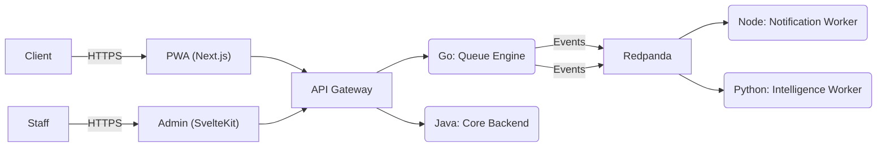

# Q-Time: Universal Queue Management System ⏳


**Q-Time** is an enterprise-grade SaaS solution designed to eliminate the uncertainty of physical waiting lines. It orchestrates real-time queuing for clinics, banks, and service centers using a robust **Polyglot Microservices Architecture**.

> **Simulation Context**: This project simulates a Series-A startup environment ("Industrial Standard"), enforcing strict separation of concerns, CI/CD gates, and Production-Ready code standards from Day 1.

---

## 📑 Table of Contents

- [Architecture & Tech Stack](#-architecture--tech-stack)
- [Monorepo Structure](#-monorepo-structure)
- [Getting Started](#-getting-started)
- [Port Mapping](#-port-mapping-local-dev)
- [Development Workflow](#-development-workflow)
- [Documentation Library](#-documentation-library)

---

## 🏗️ Architecture & Tech Stack

We utilize a **Best-for-Job Strategy**, leveraging distinct languages for specific domains.



| Domain               | Service               | Stack                           | Key Responsibility                                   |
| :------------------- | :-------------------- | :------------------------------ | :--------------------------------------------------- |
| **Edge**             | **Apps**              | **Next.js 16** / **SvelteKit**  | Public Booking PWA & Admin Dashboard.                |
| **High Performance** | `queue-engine`        | **Go 1.25** + **Fiber**         | Atomic Ticket Generation (Redis Lua), WebSocket Hub. |
| **Business Core**    | `core-backend`        | **Java 21** + **Spring Boot 4** | Billing, Tenants, Reporting.                         |
| **IO Bound**         | `notification-worker` | **Node.js 22** + **NestJS**     | WhatsApp/Email Dispatcher.                           |
| **Data/AI**          | `intelligence-worker` | **Python 3.14** + **FastAPI**   | ETA Prediction (Moving Average).                     |
| **Infrastructure**   | -                     | Docker, Redpanda, Redis, PG     | Event Streaming & Persistence.                       |

👉 _Read the full Rationale in [Tech Stack Decisions (ADR)](docs/architecture/TECH_STACK_DECISIONS.md)._

---

## 📦 Monorepo Structure

```text
qtime-monorepo/
├── apps/                       # 🖥️ Frontend Applications
│   ├── admin-web/              # SvelteKit (Admin Dashboard)
│   └── public-mobile/          # Next.js (Patient PWA)
├── services/                   # 🚀 Backend Microservices
│   ├── queue-engine/           # Go (High Perf)
│   ├── core-backend/           # Java (Business Logic)
│   ├── notification-worker/    # Node.js (Async)
│   └── intelligence-worker/    # Python (Data)
├── docs/                       # 📚 Documentation
│   ├── architecture/           # Arch, Infra, ADRs
│   ├── product/                # PRD & User Flows
│   └── project-management/     # Sprints & Tickets
├── docker-compose.yml          # 🐳 Local Infrastructure
└── Makefile                    # 🛠️ Shortcut Commands
```

---

## 🚀 Getting Started

### 1. Prerequisites

- **Docker & Docker Compose** (Required)
- **Go 1.25+**, **Java 21 LTS**, **Node 22 LTS** (Recommended for local dev)

### 2. Quick Start

Clone the repository:

```bash
git clone https://github.com/herman-xphp/qtime-monorepo.git
cd qtime-monorepo
```

Choose your starting method:

**Option A: Makefile (Recommended)**

```bash
make up
```

**Option B: Raw Docker**

```bash
docker compose up -d
```

### 3. Verify Health

Access the services (once running):

- **Queue API**: `http://localhost:3000/health`
- **Core API**: `http://localhost:8080/actuator/health`
- **Redpanda Console**: `http://localhost:8081`

---

## 🔌 Port Mapping (Local Dev)

| Service                 | Port   | Debug  | Database      | Validated URL           |
| :---------------------- | :----- | :----- | :------------ | :---------------------- |
| **Queue Engine**        | `3000` | `2345` | Redis `8`     | `POST /queue/take`      |
| **Core Backend**        | `8080` | `5005` | Postgres `18` | `POST /auth/login`      |
| **Notification Worker** | `3001` | `9229` | -             | -                       |
| **Intelligence Worker** | `3002` | -      | -             | `GET /eta/{id}`         |
| **Admin Web**           | `5173` | -      | -             | `http://localhost:5173` |
| **Public PWA**          | `3005` | -      | -             | `http://localhost:3005` |

---

## 📚 Documentation Library

Please read these before writing code:

### 🧠 Planning & Architecture

- **[Vision & PRD](docs/product/PRD.md)**: Product Requirements.
- **[Architecture](docs/architecture/ARCHITECTURE.md)**: System Design.
- **[Frontend Architecture](docs/architecture/FRONTEND_ARCHITECTURE.md)**: UI Strategy.
- **[API Specification](docs/api/API_SPEC.md)**: Clean URL Contracts (No `/v1`).

### ⚙️ Standards

- **[Coding Standards](docs/standards/CODING_STANDARDS.md)**: Go, Java, TS, Python rules.
- **[Git Workflow & AI Protocol](docs/standards/GIT_WORKFLOW.md)**: How to commit & collaborate.

### 📅 Project Management

- **[Roadmap](docs/project-management/ROADMAP_TO_PRODUCTION.md)**: Timeline.
- **Active Sprints**:
  - [Backend Plan](docs/project-management/sprints/backend/SPRINT_1.md)
  - [Frontend Plan](docs/project-management/sprints/frontend/SPRINT_1.md)

---

## ⚡ Performance Benchmarks (k6)

The system is tested to handle high-concurrency "Flash Sale" scenarios (1,000 Concurrent Users).

**Load Test Scenario**:

- **Tool**: [k6](https://k6.io/)
- **Script**: `tests/k6/load-test.js`
- **Simulation**: 1,000 Virtual Users (VU) taking tickets and checking ETA.

**Actual Results**:

- **Checks Succeeded**: 100.00% (0 errors)
- **RPS (Throughput)**: 730 requests/sec
- **p95 Latency**: **47.22ms** (Target was < 500ms)
- **Check Breakdown**:
  - `✓ ticket created`
  - `✓ has ticket number`
  - `✓ eta retrieved`

---

## 🛠️ Shortcut Commands (Makefile)

We use a `Makefile` to simplify common development tasks.

| Category    | Makefile Command   | Docker Equivalent                      | Description              |
| :---------- | :----------------- | :------------------------------------- | :----------------------- |
| **Infra**   | `make up`          | `docker compose up -d`                 | Start all containers     |
|             | `make down`        | `docker compose down`                  | Stop all containers      |
|             | `make build`       | `docker compose build`                 | Rebuild images           |
|             | `make ps`          | `docker compose ps`                    | Show containers          |
| **Logs**    | `make logs`        | `docker compose logs -f`               | Follow all logs          |
|             | `make logs-q`      | `docker compose logs -f queue-engine`  | Follow Queue Engine logs |
|             | `make logs-c`      | `docker compose logs -f core-backend`  | Follow Core Backend logs |
| **Testing** | `make test`        | (See scripts/mvnw/go test)             | Run Unit Tests (Local)   |
|             | `make test-api`    | `curl ...` (See Makefile)              | Run quick API check      |
| **Tools**   | `make db-shell`    | `docker compose exec postgres psql...` | Open Postgres Shell      |
|             | `make redis-shell` | `docker compose exec redis redis-cli`  | Open Redis Shell         |

---

## 🤝 Contribution Workflow

1.  Pick a ticket from:
    - **[Backend Tickets](docs/project-management/tickets/BACKEND_TICKETS.md)**
    - **[Frontend Tickets](docs/project-management/tickets/FRONTEND_TICKETS.md)**
2.  Create branch: `git checkout -b feat/queue-logic`
3.  Commit (Conventional): `git commit -m "feat(queue): implement atomic redis lock"`
4.  Push & PR.

---

_Built with ❤️ by the Q-Time Engineering Team_
